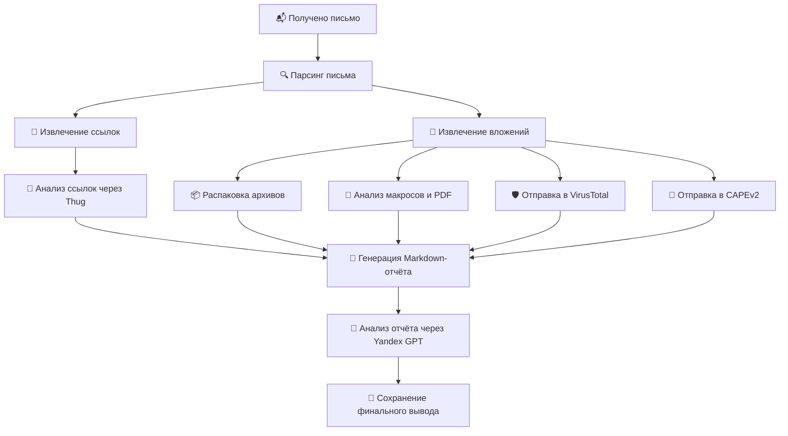

# README.md

# 📧 email-analyzer

Инструмент для анализа входящих писем с целью обнаружения вредоносных ссылок и вложений. Включает:
- Распаковку архивов
- Анализ ссылок через `thug`
- Анализ макросов и PDF через `oletools` и `pdf-parser`
- Отправку файлов и ссылок в VirusTotal и CAPEv2
- Генерацию Markdown-отчёта
- Обобщение отчёта с помощью Yandex GPT

---

## 🚀 Запуск

### 🔧 Сборка Docker-образа:
```bash
docker build -t email-analyzer .
```

### 📥 Пример `.env` файла:
```env
VT_API_KEY=your_virustotal_key
CAPE_URL=http://localhost:8000
```

### ▶️ Пример запуска:
```bash
docker run --rm --env-file .env -v $(pwd)/samples:/samples email-analyzer \
  --eml /samples/sample.eml
```

> `sample.eml` — файл письма для анализа.  
> Ключи передаются через переменные окружения.

---

## 📊 Архитектура пайплайна


---

## 📁 Структура проекта
```
email-analyzer/
├── analyzers/
│   ├── mail.py
│   ├── urls.py
│   ├── attachments.py
│   ├── report.py
│   └── yandex_gpt.py
├── main.py
├── Dockerfile
├── requirements.txt
├── entrypoint.sh
├── .env.example
└── README.md
```

---

## 🧠 GPT-интеграция
Для доступа к Yandex GPT необходимо:
- Установить `yandex-cloud` SDK
- Настроить OAuth или сервисный аккаунт (см. [документацию](https://cloud.yandex.ru/docs/iam/operations/sa/))

---

## 🔐 Зависимости
- Python 3.11
- `thug` (устанавливается из GitHub)
- `oletools`, `pefile`, `py7zr`, `rarfile`
- `yandex-cloud` SDK
- Системные утилиты: `unrar`, `p7zip-full`, `libmagic1`

---

## 📄 Лицензия
MIT
