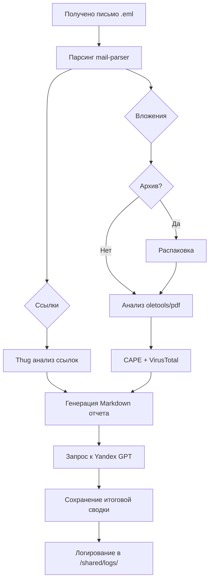

# Email Analyzer 🕵️‍♂️📧

Простой локальный sandbox для анализа подозрительных писем. Поддерживает:
- парсинг `.eml` файлов
- анализ ссылок с помощью [Thug](https://github.com/buffer/thug)
- отправку вложений в [CAPE Sandbox](https://github.com/ctxis/CAPE) и VirusTotal
- анализ PDF, DOC, ZIP и других форматов
- генерацию текстового отчета
- суммаризацию отчета с помощью Yandex GPT

---

## 📦 Установка

```bash
git clone https://github.com/yourname/email-analyzer
cd email-analyzer
cp .env.example .env
# добавьте свои ключи в .env
sudo docker-compose up --build
```

## 📂 Структура проекта

```text
email-analyzer/
├── analyzers/            # Модули анализа (mail, urls, attachments, report, yandex_gpt)
├── samples/              # Входящие .eml письма для анализа
├── shared/               # Общая папка для взаимодействия с Thug и логами
│   └── logs/             # Логи анализов (создаются автоматически)
├── thug/                 # Dockerfile для Thug
├── main.py               # Основной скрипт анализа
├── Dockerfile            # Dockerfile анализатора
├── docker-compose.yml   # Композиция сервисов
├── README.md             # Документация
└── requirements.txt      # pip-зависимости
```

## ✅ Пример запуска
Просто положите `.eml` файлы в `samples/`, и они будут автоматически обработаны при старте:
```bash
samples/
└── suspicious_mail.eml
```

Результаты:
- `/shared/report_*.md` — текстовый отчет
- `/shared/report_*_gpt.txt` — сводка от GPT
- `/shared/logs/analysis.log` — лог анализа

---

## 📈 Mermaid-граф пайплайна



---

## 📌 Переменные окружения
Укажите в `.env`:
```dotenv
VT_API_KEY=your_virustotal_api_key
YC_AUTH=your_yandex_auth_token
YC_FOLDER_ID=your_yandex_folder_id
```

---

## 🐸 Бонус
При запуске вас поприветствует ASCII-жабка 🐸 — символ спокойного анализа в этом сумасшедшем мире фишинга.

---

## ⚠️ Предупреждение
Это образовательный инструмент. Не подключайте к боевым инфраструктурам.

---

## 📬 Контакты
**Автор:** @your_tg | GitHub: [yourname](https://github.com/yourname)
