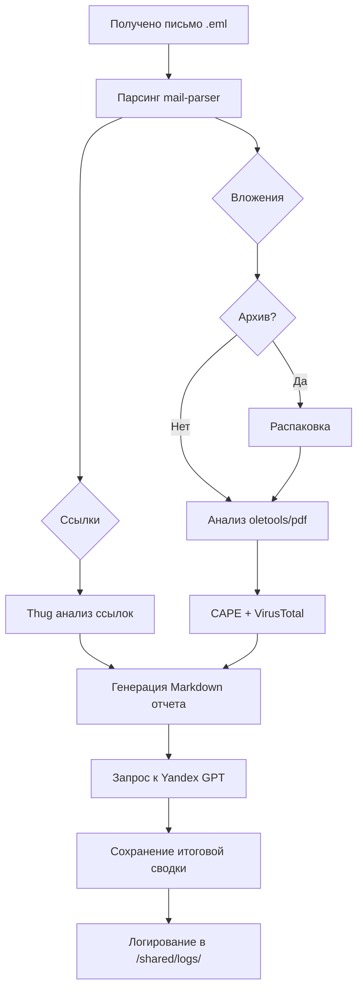

# 📧 Email Analyzer

Простой локальный sandbox для анализа подозрительных писем. Поддерживает:

- 📥 Парсинг `.eml` файлов с помощью `mail-parser`
- 🔗 Анализ ссылок через `Thug` (в Docker или локально)
- 📎 Отправку вложений в `CAPE Sandbox` и `VirusTotal`
- 📄 Анализ PDF, DOC, ZIP и других форматов
- 📝 Генерацию текстового отчета
- 🤖 Суммаризацию отчета с помощью `Yandex GPT`

---

## 🚀 Установка

### 📋 Требования
- Python **3.8+**
- Docker (для контейнерного запуска Thug — опционально)
- `pip` для установки Python-зависимостей

### 📦 Установка зависимостей
```bash
sudo apt install python3-pip
git clone https://github.com/serj12342/email-analyzer
cd email-analyzer
pip3 install -r requirements.txt
```

### ⚙️ Настройка `.env`
```bash
cp .env.example .env
nano .env
```
Укажите ключи:
```
VT_API_KEY=your_virustotal_api_key
CAPE_URL=http://your-cape-server:8000
YC_AUTH=your_yandex_auth_token
YC_FOLDER_ID=your_yandex_folder_id
```

---

## 🧪 Установка Thug

### Вариант 1: Установка Thug на хост-систему
```bash
sudo apt update
sudo apt install -y build-essential python3-dev libpcre3-dev \
  libxml2-dev libxslt1-dev libffi-dev libssl-dev autoconf libtool

git clone https://github.com/buffer/libemu.git
cd libemu
autoreconf -v -i
./configure --prefix=/usr
make
sudo make install
cd ..

pip3 install pymongo lxml pygraphviz pylibemu thug

thug --version

sudo chmod -R 777 shared/thug_logs
```

### Вариант 2: Thug в Docker
```bash
sudo docker-compose up --build
sudo chmod -R 777 shared/thug_logs
```

> ☝️ Убедитесь, что `analyzers/urls.py` настроен под ваш способ запуска thug (локально или через Docker).

---

## 🗂️ Структура проекта
```
email-analyzer/
├── analyzers/            # Модули анализа (mail, urls, attachments, report, yandex_gpt)
├── samples/              # Входящие .eml письма для анализа
├── shared/               # Общая папка для логов и отчетов Thug
│   └── logs/             # Логи анализов (создаются автоматически)
├── thug/                 # Dockerfile для Thug (для контейнерного запуска)
├── main.py               # Основной скрипт анализа
├── Dockerfile            # Dockerfile анализатора
├── docker-compose.yml    # Композиция сервисов
├── .env.example          # Пример файла окружения
├── README.md             # Документация
└── requirements.txt      # pip-зависимости
```

---

## 🧪 Пример запуска
1. Положите `.eml` файлы в папку `samples/`:
```
samples/
└── suspicious_mail.eml
```
2. Запустите анализ:
```bash
python3 main.py
```
3. Результаты:
- `/reports/final/report_*.md` — Markdown-отчет
- `/reports/final/report_*_gpt.txt` — сводка от GPT
- `/shared/logs/analysis.log` — лог анализа
- `/shared/thug_logs/report_*/report.json` — отчет Thug

---

## 📈 Пайплайн (Mermaid)


---

## 🔐 Переменные окружения
Файл `.env`:
```
VT_API_KEY=your_virustotal_api_key
CAPE_URL=http://your-cape-server:8000
YC_AUTH=your_yandex_auth_token
YC_FOLDER_ID=your_yandex_folder_id
```

---

## 🐸 Бонус
При запуске вас приветствует ASCII-жабка — символ спокойного анализа в безумном мире фишинга.

---

## ⚠️ Предупреждение
Это **образовательный** инструмент. **Не подключайте к боевым инфраструктурам.**

---

## 📬 Контакты
Автор: [@serj12342](https://github.com/serj12342)